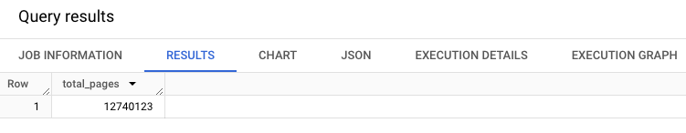
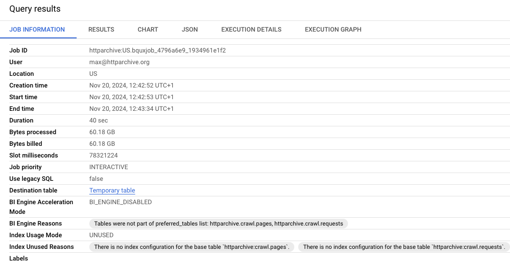
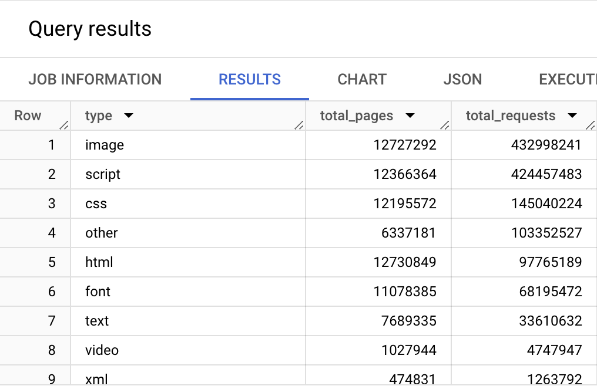
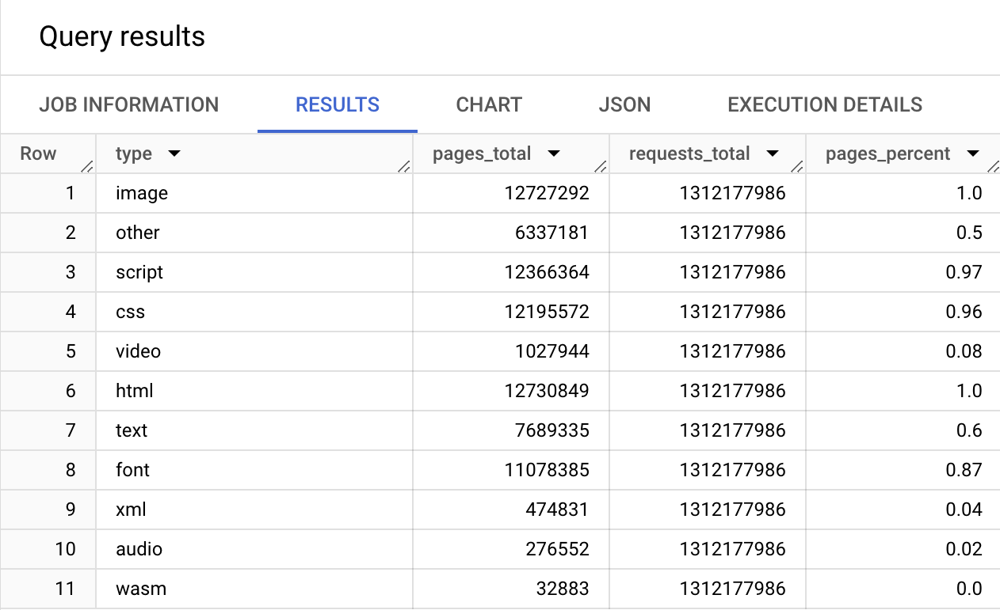

The [HTTP Archive](https://httparchive.org) is an open source project that tracks how the web is built. Historical data is provided to show how the web is constantly evolving, and the project is frequently used for research by the web community, scholars and industry leaders. If you are interested in digging into the HTTP Archive and are not sure where to start, then this guide should help you get started quickly.

There are over 1 million pages tracked on desktop and emulated mobile in the most recent HTTP Archive data, and the historical data goes back to 2010. While the HTTP Archive website makes a lot of information available via [curated reports](https://httparchive.org/reports), analyzing the raw data is a powerful way of answering your questions about the web.

All of the data collected by the HTTP Archive is available via [Google BigQuery](https://cloud.google.com/bigquery/). This makes analyzing the data easy because all of the storage and indexing is taken care of for you. And with the processing power behind BigQuery, even some of the most complex queries runs in seconds.

This document is an update to [Ilya Grigorik's 2013 introduction](https://www.igvita.com/2013/06/20/http-archive-bigquery-web-performance-answers/), and walks you through everything you need to get started accessing BigQuery and analyzing the data.

## Setting up BigQuery to Access the HTTP Archive

In order to access the HTTP Archive via BigQuery, you'll need a Google account. To document this process for new visitors, this example uses a new Google account that has never logged into any Google Cloud services.

1. Navigate to the [Google Cloud Projects Page](https://console.cloud.google.com/start) and log in with your Google account if prompted. If this is your first time accessing Google Cloud, you may be prompted to accept the terms of service. Once you are logged in, you'll see a page like this:

    

2. Click **Select a project** and then **New Project**. This takes you to a New Project page.

    

3. Give your project a name and then click the **Create** button.

    

4. Optional: Enable Billing by clicking on the Billing menu item and adding your billing information.

    :::note
    BigQuery has a [free tier](https://cloud.google.com/bigquery/pricing#free-tier) that you can use to get started without enabling billing. At the time of this writing, the free tier allows 10GB of storage and 1TB of data processing per month. Google also provides a [$300 credit for new accounts](https://cloud.google.com/free/docs/frequently-asked-questions#free-trial).
    :::

5. Navigate to the [BigQuery console](https://console.cloud.google.com/bigquery) where you should see your project, with no data.

6. In order to add the HTTP Archive tables to your project, click on the **+ Add** button on top of the Explorer sidebar and choose the **Star a project by name** option from the side menu.

7. Type in `httparchive` (case-sensitive) and click **STAR**.

8. You should now see the HTTP Archive data set pinned:

    

9. Let's run a quick sample query to confirm access is all working. Navigate to the `crawl` dataset and select the `pages` table:

    

10. Click on the **QUERY** button and select **In a new tab**:

    

11. Change the query to take a small sample of the table (e.g. `SELECT *`), click the `RUN` button and you should see the results of your query.

    :::danger
    The size of the tables you query are important because BigQuery is billed based on the number of processed data. There is 1TB of processed data included in the free tier, so running a full scan query on one of the larger tables can easily eat up your quota. This is where it becomes important to design queries that process only the data you wish to explore.

    HTTP Archive collecting metadata from millions of websites each month, an the dataset is _extremely large_—multiple petabytes.

    See the guide on [minimizing query costs](/guides/minimizing-costs/) to learn more.

    Also, take a moment setting up [cost controls](https://cloud.google.com/bigquery/docs/custom-quotas) to be informed of the costs inqurred throughout the month.
    :::

    ```sql
    SELECT *
    FROM `httparchive.crawl.pages` TABLESAMPLE SYSTEM (0.00001 PERCENT)
    WHERE date = "2024-05-01"
    ```

    

In the next section, we explore the structure of these tables so you can start digging in!

## Understanding how the tables are structured

So, now you have access! But what do you have access to?

The table below outlines what some of the different tables include. You'll find page views and HTTP requests. There are also JSON encoded HAR files for pages, requests, lighthouse reports and even response bodies!

Table | Monthly Size | Monthly Rows | History Since
--|--|--|--
summary_pages.* | ~16 GB | Desktop: ~13M, Mobile: ~16 M | Desktop: Nov 2010, Mobile: May 2011
summary_requests.* | ~1.9 TB | Desktop: ~1.3B, Mobile: ~1.5B | Desktop: Nov 2010, Mobile: May 2011
pages.* | ~3.1 TB | Desktop: ~13 M, Mobile: ~16 M | Jan 2016
requests.* | ~12.5 TB | Desktop: ~1.3 B, Mobile: ~1.5 B | Jan 2016
response_bodies.* | ~48 TB | Desktop: ~647 M, Mobile: ~780 M | Jan 2016
crawl.pages | ~42 TB | Desktop: ~24M, Mobile: ~30M | Mar 2022
crawl.requests | ~231 TB | Desktop: ~2.4B, Mobile: ~2.7B | Mar 2022
lighthouse.* | ~200 GB | Desktop: 12M, Mobile: ~16M | June 2017

:::note
If table names are mentioned as a wildcard, then the table names all follow the format `yyyy_mm_dd_desktop` and `yyyy_mm_dd_mobile`.
Size and row are rounded counts as of May 2024.
:::

In order to understand what each of these tables contain, you can click on the table name and view the details. For example, if you expand the `crawl` dataset and click on the `pages` table you can see the schema. Clicking **Details** tells you some information about the table, such as its size and the number of rows. Clicking **Preview** shows an example of some data from the table.


Some of the types of tables you'll find useful when getting started are described below.

### HAR Tables

The HTTP Archive stores detailed information about each page load in [HAR (HTTP Archive) files](https://en.wikipedia.org/wiki/.har). Each HAR file is JSON formatted and contains detailed performance data about a web page. The [specification for this format](https://w3c.github.io/web-performance/specs/HAR/Overview.html) is produced by the Web Performance Working Group of the W3C. The HTTP Archive splits each HAR file into multiple BigQuery tables, which are described below.

* [`httparchive.crawl.pages`](/reference/tables/pages/):

  * HAR extract for each page url.
  * This table is very large (~938TB as of Jun 2024).

* [`httparchive.crawl.requests`](/reference/tables/requests/):

  * HAR extract for each resource.
  * This table is very large (4.97PB as of Jun 2024)

### Other Tables

* [`httparchive.blink_features.usage`](https://console.cloud.google.com/bigquery?ws=!1m5!1m4!4m3!1shttparchive!2sblink_features!3susage):

  * Summary information about the [Blink features](https://chromestatus.com/roadmap) detected on each page.
  * Table contains the num_urls, the pct_urls and sample urls for each feature.
  * This data is also available in the HAR of the `pages` table but is extracted into the `blink_features` tables for easy lookup.
  * This table is 944 MB as of May 2024.

## Some Example Queries to Get Started Exploring the Data

The [HTTP Archive Discuss section](https://discuss.httparchive.org/) has lots of useful examples and discussion on how to analyze this data.

Now that you are all set up, let's run some queries! Most HTTP Archive users start off examining the summary tables, so we'll start there as well. Below is a simple aggregate query that tells you how many URLs are contained in the latest HTTP Archive data.

```sql
SELECT
  COUNT(0) total_pages
FROM
  `httparchive.crawl.pages`
WHERE
  date = "2024-06-01"
  AND client = "desktop"
  AND is_root_page
```



Perhaps you want to JOIN the pages and requests tables together, and see how many page URLs and request URLs are in this data set.

```sql
SELECT
  COUNT(DISTINCT pages.page) total_pages,
  COUNT(0) total_requests
FROM
  `httparchive.crawl.pages` pages
INNER JOIN
  `httparchive.crawl.requests`requests
ON
  pages.page = requests.page
WHERE
  pages.date = "2024-06-01"
  AND requests.date = "2024-06-01"
  AND pages.client = "desktop"
  AND requests.client = "desktop"
  AND pages.is_root_page
  AND requests.is_root_page
```

When we look at the results of this, you can see how much data was processed during this query. Writing efficient queries limits the number of bytes processed - which is helpful since that's how BigQuery is billed.

:::note
There is [1TB free per month](https://cloud.google.com/bigquery/pricing#on_demand_pricing).
:::



If you look closely, you'll notice that this particular query could actually be written without the JOIN. For example, we can count `distinct page` from the `requests` table instead of JOINing the `pages` table. If you run this query, you'll notice that the results are the same as the previous query, and the processed bytes are a bit less.

```sql
SELECT
  COUNT(DISTINCT page) total_pages,
  COUNT(0) total_requests
FROM
  `httparchive.crawl.requests`
WHERE
  date = "2024-06-01"
  AND client = "desktop"
  AND is_root_page
```

Next let's summarize all of the HTTP requests by a type, and the number of pages that contain at least one request of that type. In the example below, you can see that I added `type` to the SELECT clause, added a GROUP clause and sorted the results by types that have the most requests.

```sql
SELECT
  type,
  COUNT(DISTINCT page) total_pages,
  COUNT(0) total_requests
FROM
  `httparchive.crawl.requests`
WHERE
  date = "2024-06-01"
  AND client = "desktop"
  AND is_root_page
GROUP BY
  type
ORDER BY
  total_requests DESC
```

Now things are starting to get interesting.



So let's try to learn something from this basic example. We know from the first example that there are 12.7 million URLs in the latest HTTP Archive dataset. Let's calculate the percent of pages that have each resource type. To do this, we'll divide the number of pages by the total pages (using our first query as a subquery). Then we'll use a `ROUND()` function to trim the result to 2 decimal points.

```sql
WITH requests AS (
  SELECT
    type,
    page,
    COUNT(0) OVER () AS requests_total,
    COUNT(DISTINCT page) OVER () AS pages_total,
  FROM `httparchive.crawl.requests`
  WHERE
    date = "2024-06-01"
    AND client = "desktop"
    AND is_root_page
)

SELECT
  type,
  COUNT(DISTINCT page) AS pages_total,
  ANY_VALUE(requests_total) AS requests_total,
  ROUND(COUNT(DISTINCT page) / ANY_VALUE(pages_total), 2) AS pages_percent
FROM requests
GROUP BY
  type
ORDER BY
  pages_percent DESC
```

When analyzing the results from this, you can see the % of websites that use different resource types. You can see that:

* 100% of sites have HTML and at least one image,
* 97% have at least 1 script resource,
* 96% load at least 1 CSS style,
* and 87% load fonts on their homepage, etc.



To explore more interactive examples, read the [Guided Tour](../guided-tour/).

If you want to explore deeper you have everything you need - infrastructure, documentation, community. Enjoy exploring this data and feel free to share your results and ask questions on the [HTTP Archive Discuss section](https://discuss.httparchive.org/).
