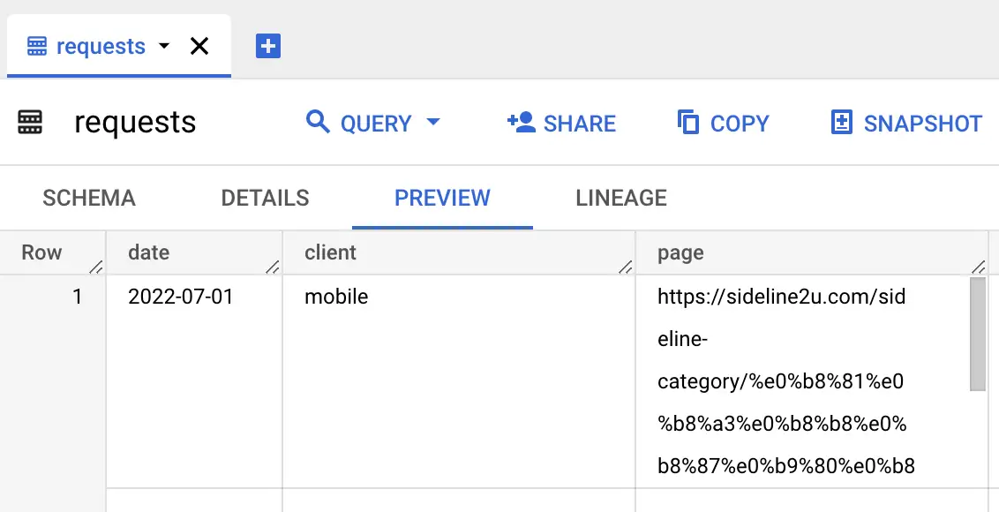

The HTTP Archive dataset is large and complex, and it's easy to write queries that are slow and expensive. All BigQuery users have a free quota of 1 TB per month. To stretch your free quota as far as possible, you'll want to minimize the amount of data that your queries scan. This guide provides some practical tips for minimizing the cost of querying the HTTP Archive dataset.

## Use cluster columns

Table | Partitioned by | Clustered by
--- | --- | ---
`httparchive.crawl.pages` | `date` | `client`<br>`is_root_page`<br>`rank`<br>`page`
`httparchive.crawl.requests` | `date` | `client`<br>`is_root_page`<br>`type`<br>`rank`

For example, the `httparchive.crawl.pages` table is [partitioned](https://cloud.google.com/bigquery/docs/partitioned-tables) by `date` and [clustered](https://cloud.google.com/bigquery/docs/clustered-tables) by the `client`, `is_root_page`, `rank` and `page` columns, which means that queries that filter on these columns will be much faster and cheaper than queries that don't.

:::caution
BigQuery [doesn't guarantee](https://cloud.google.com/bigquery/docs/clustered-tables#clustered_table_pricing:~:text=BigQuery%20might%20not%20be%20able%20to%20accurately%20estimate%20the%20bytes%20to%20be%20processed) accuracy of estimations for 'Bytes processed' when querying clustered tables ([Issue Link](https://issuetracker.google.com/issues/176795805)). The actual data volume may be smaller than the amount provided in the estimate.
:::

:::tip
Filter by the top 1k websites. This is the smallest rank bucket and will result in the smallest amount of data being scanned.

```sql
SELECT
  page
FROM
  `httparchive.crawl.pages`
WHERE
  date = '2023-05-01' AND
  client = 'desktop' AND
  rank <= 1000
```

:::

:::tip
Use the `type` column for `requests` table as often you may only be interested in `html` and `script` contents but not `css` for example.

```sql
SELECT
  page
FROM
  `httparchive.crawl.requests`
WHERE
  date = '2023-05-01' AND
  client = 'desktop' AND
  rank <= 1000 AND
  type IN ('html', 'script')
```

This is particularly relevant if using the `response_bodies` or `payload` columns. But these are large columns so try to avoid using them where at all possible. Also note that binary response bodies (e.g. images and fonts) are not stored, so these are mostly `html`, `script`, and `css` so selecting all three of those will not save much.
:::

## Use the `RECORD` columns

Some of our columns in the table are structured `RECORD` columns. When querying these you only pay for the costs of the records needed.

```sql
SELECT
  custom_metrics
FROM
  `httparchive.crawl.pages`
WHERE
  date = '2023-05-01' AND
  client = 'desktop' AND
  rank <= 1000
```

This query will process 329 MB when run as it's looking at all the custom_metrics.

However, the same query looking at just the `a11y` custom metrics is much cheaper at 10 MB:

```sql
SELECT
  custom_metrics.a11y
FROM
  `httparchive.crawl.pages`
WHERE
  date = '2023-05-01' AND
  client = 'desktop' AND
  rank <= 1000
```

## Use `TABLESAMPLE`

The `TABLESAMPLE` clause allows you to sample a table without scanning the entire table. This is useful for getting a rough idea of the data in a table before running a more expensive query.

For example, without `TABLESAMPLE`:

```sql
SELECT
  custom_metrics.other.avg_dom_depth
FROM
  `httparchive.crawl.pages`
WHERE
  date = '2023-05-01' AND
  client = 'desktop'
```

This query will process 6.56 TB when run.

However, the same query with `TABLESAMPLE` at 0.01% is much cheaper:

```sql
SELECT
  custom_metrics.other.avg_dom_depth
FROM
  `httparchive.crawl.pages` TABLESAMPLE SYSTEM (0.01 PERCENT)
WHERE
  date = '2023-05-01' AND
  client = 'desktop'
```

This query will only process 680.01 MB when run.

The 0.01% of rows that are sampled are chosen randomly, so the results of the query will be different each time it's run.

:::danger
## Don't rely on LIMIT
Don't rely on the `LIMIT` clause to reduce the amount of data scanned. `LIMIT` is applied after the query is run, so the entire table will still be scanned.

For example, this query still processes 6.56 TB:

```sql
SELECT
  custom_metrics.other.avg_dom_depth
FROM
  `httparchive.crawl.pages`
WHERE
  date = '2023-05-01' AND
  client = 'desktop'
LIMIT
  1
```

:::

## Use RANK

An alternative to `TABLESAMPLE`, to get a consistent set of data returning for a subset of data, is to use the `rank` column as mentioned previously. For the top 1,000 or even 10,000 sites:

```sql
SELECT
  custom_metrics.other.avg_dom_depth
FROM
  `httparchive.crawl.pages`
WHERE
  date = '2023-05-01' AND
  client = 'desktop' AND
  rank <= 1000
```

While this constency is an advantage over `TABLESAMPLE`, annoyingly due to the [previously mentioned bug](https://issuetracker.google.com/issues/176795805), using `rank` will not give an accurate estimate, while `TABLESAMPLE` will. So it can be a bit more of a leap of faith using `rank`.

To get around that you can use the `sample_data` dataset.

## Use the `sample_data` dataset

The `sample_data` dataset contains 10k subsets of the full pages and requests tables. These tables are useful for testing queries before running them on the full dataset, without the risk of incurring a large query cost.

Table names correspond to their full-size counterparts of the form `[table]_10k` for `crawl.pages` and `crawl.requests` tables. For example, to query the summary data for the subset of 10k pages, you would use the `httparchive.sample_data.pages_10k` table.

In reality as `rank` is part of the clustering of the tables you don't need to use the `sample_data` dataset. However, due to inaccurate estimates mentioned above, the `sample_data` dataset is safer since it only contains 10,000 pages so even with inaccurate estimates it will be smaller than the full `crawl` dataset.

## Whether to use `TABLESAMPLE`, `rank`, or `sample_data`

This comes down largely to a matter of personal preference. Each has their advantage and disadvantage.

Advantage |`TABLESAMPLE`|`rank`|`sample_data`
----|---|---|---
Consistency of results returned|❌|✅|✅ (if run in same month)
Accurate estimates|✅|❌|✅
Ease of commenting out for full run|✅|✅|❌
Allows querying of any months|✅|✅|❌ (previous month only)
Allows variable sample size|✅|✅|❌

If they ever fix the estimate bug then `rank` will be a clear winner. Until then use whatever works for you!

## Use table previews

BigQuery allows you to preview entire rows of a table without incurring a query cost. This is useful for getting a rough idea of the data in a table before running a more expensive query.



To access the preview, click on a table name from the workspace explorer and select the **Preview** tab.

Note that generating the preview may be slow for these tables as they include large payloads. Also note that the text values are truncated by default, so you will need to expand the field to get the full value.
