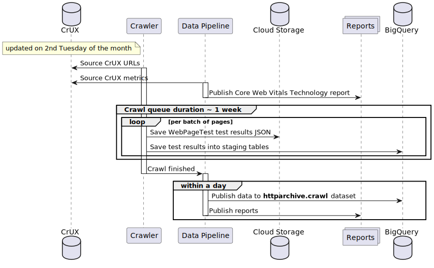

The HTTP Archive dataset is updated each month with data from millions of web pages. This guide explores the end-to-end release cycle from sourcing URLs to publishing results to BigQuery.

[](https://www.plantuml.com/plantuml/uml/RL5DRnCn4BtxLppr60aaEFQ0Aie9eHAQ5BXExEckXMCRUvme5tuxpdgtkrNNKYpvPTxi-xZBGadAqIb3GWVAZFlqz5l5Ybfj8tcf09qTfrVOraPsrZCeu-PBfRuWDujDBXIpav2eQuC3W8RKGHsSOoqs-8n7ZY59dicVRVUZSBeezH244KwS1cctAB4EiK7m-EWDzeMpeGl2CwHd78ENNgbHzBjFZRCB9Udc3K-Ftx8YBVP4mY_kK8-QJApHZYp9wWLp6bOBscZZ5jjoS3Rtk0-9yOiF-6c5NCQUTU-32zq5QPXLXjziR6Aw54fi-l2tS66OakWQ5_xX0yxCVuP15q94v8G3YUwlEKJgE2kCPuvYqKVrHgT1sRQ-zfm5ShqIv-8au-lk-yFR3LCfZVsQORq4PA7E-WwrH3TAO6zK_IqgcMpYTdJtR7tDYatpRNYzd9R7sKflFGYrym5VJszwp9hdJWm9GG8scruaKjAzFV5xVVtMPZFycrdcBUl5jlQQnPKA1yjtzIf7zny0)

## Sourcing URLs

The pages HTTP Archive tests are ultimately sourced from the [Chrome UX Report](https://developer.chrome.com/docs/crux/) (CrUX) dataset. CrUX is a public dataset that contains anonymized, aggregated metrics about real-world Chrome users' experiences on popular destinations on the web. HTTP Archive takes the _origins_ in the public CrUX dataset and classifies them as either desktop and mobile. Origins are segmented by desktop or mobile depending on the [`form_factor`](https://developer.chrome.com/docs/crux/methodology/#form-factor-dimension) dimension in the CrUX schema, which corresponds to the actual device type real visitors used to access the website.

CrUX also includes origins without any distinct form factor data. HTTP Archive classifies these origins as _both_ desktop and mobile.

## Running the crawl

Previously, HTTP Archive would start testing each web page (the crawl) on the first of the month. Now, to be in closer alignment with the upstream CrUX dataset, HTTP Archive starts testing pages as soon as the CrUX dataset is available on the second Tuesday of each month. Crawl dates are always rounded down to the first of the month, regardless of which day they actually started. For example, the June 2023 crawl kicks off on the 13th of the month, but the dataset would be accessible on BigQuery under the date `2023-06-01`.

:::note
As of [May 2023](https://httparchive.org/reports/state-of-the-web?start=2023_04_01&end=2023_05_01&view=list#numUrls) there are 16.6 million mobile pages and 12.8 million desktop pages. It takes 1–2 weeks to test all of these pages, so the crawl is usually complete in the second half of the month.
:::

## Publishing the raw data

As each page's test results are completed, the raw data is saved to a public Google Cloud Storage bucket. Once the crawl is complete, the data is processed and published to BigQuery. The `httparchive.crawl` dataset is available to the public for analysis.

## Generating reports

The reports on the [HTTP Archive website](https://httparchive.org/reports) and auxilliary ones like the [Core Web Vitals Technology Report](https://httparchive.org/reports/techreport/landing) are automatically generated as soon as the data is available in BigQuery.
